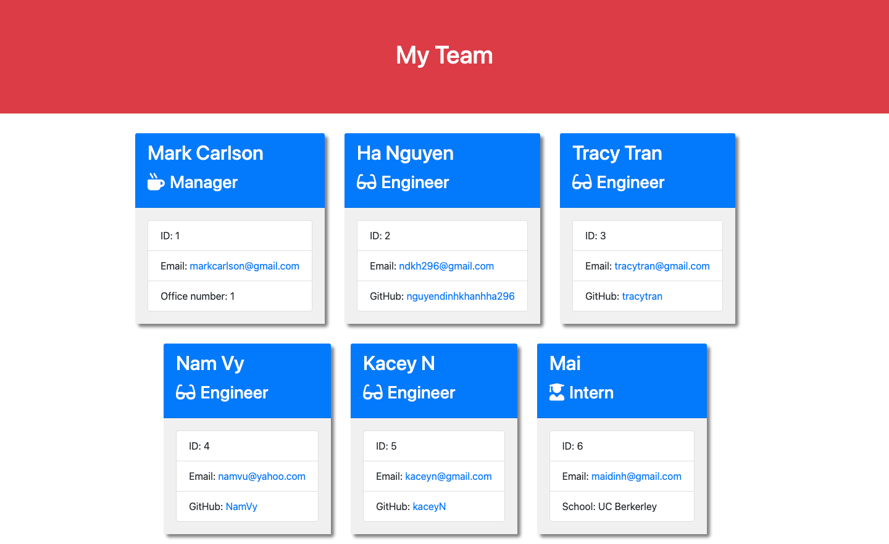

<h1 align="center">TEAM PROFILE GENERATOR</h1>
   
  
<p align="center">
    
    
    
    
</p>
  
<p align="center">
    
    
    
    
    
</p>

## Screenshot


   
## Description
  
🔍 A Node.js command-line application that takes in information about employees on a software engineering team, then generates an HTML webpage that displays summaries for each person [here](./dist/team.html)  
  
💻 Below is the gif showing the functionality of the application:
  
.gif)
  
🎥 The full movie file showing functionality of the application can be found [here](./assets/Screen%20Recording%202022-08-23%20at%2013.14.17.mov)  
  
## User Story
  
```
AS A manager
I WANT to generate a webpage that displays my team's basic info
SO THAT I have quick access to their emails and GitHub profiles 
```
  
## Acceptance Criteria
  
``` 
GIVEN a command-line application that accepts user input
WHEN I am prompted for my team members and their information
THEN an HTML file is generated that displays a nicely formatted team roster based on user input
WHEN I click on an email address in the HTML
THEN my default email program opens and populates the TO field of the email with the address
WHEN I click on the GitHub username
THEN that GitHub profile opens in a new tab
WHEN I start the application
THEN I am prompted to enter the team manager’s name, employee ID, email address, and office number
WHEN I enter the team manager’s name, employee ID, email address, and office number
THEN I am presented with a menu with the option to add an engineer or an intern or to finish building my team
WHEN I select the engineer option
THEN I am prompted to enter the engineer’s name, ID, email, and GitHub username, and I am taken back to the menu
WHEN I select the intern option
THEN I am prompted to enter the intern’s name, ID, email, and school, and I am taken back to the menu
WHEN I decide to finish building my team
THEN I exit the application, and the HTML is generated
```
  
## Table of Contents
- [Description](#description)
- [User Story](#user-story)
- [Acceptance Criteria](#acceptance-criteria)
- [Table of Contents](#table-of-contents)
- [Installation](#installation)
- [Usage](#usage)

## Installation
💾   
  
`npm install --save-dev jest`
  
`npm install inquirer`
  
## Usage
💻   
  
Run the following command at th root of your project and answer the prompted questions:
  
`node index.js`


